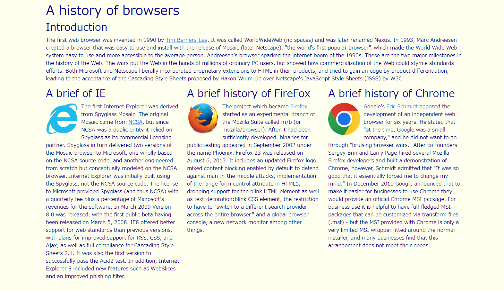
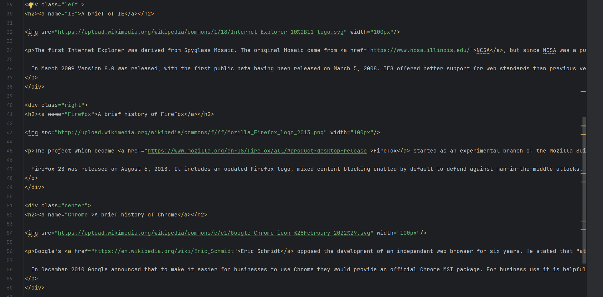
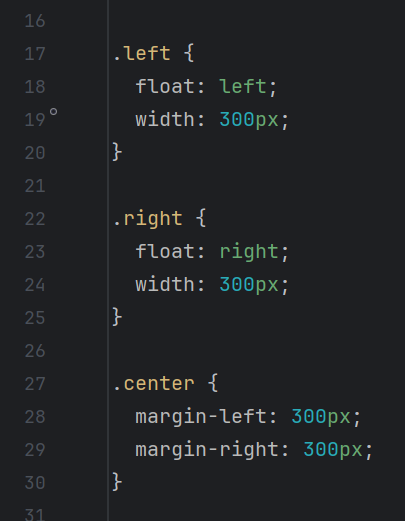
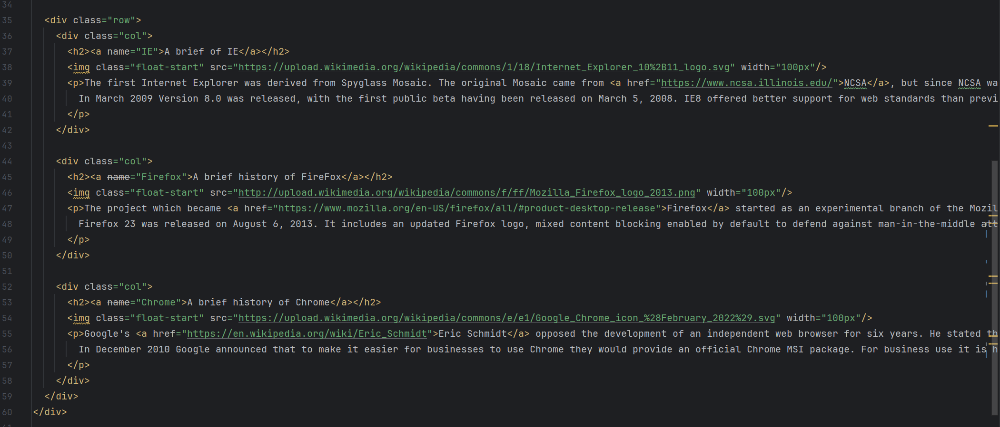

## Importance of UI Frameworks

Becoming proficient in using a UI framework effectively is as complex and time-consuming as learning a new programming language in practice. Bootstrap 5 provides an extensive amount of documentation and makes it easy to implement various features, but to be able to customize them, it is required to familiarize themselves with various class names and learn how to adjust things like margins. It's not something that anyone can easily create a UI just by looking at the documentation, and most people gradually become skilled by actually writing code, displaying HTML in the browser, and making adjustments. Mastering a UI framework through such effort brings various benefits in web development.

## Based on Experience

In the past, when working with HTML and CSS without using UI frameworks, it was necessary to build structures from scratch and make multiple adjustments such as sizing and margins. After gaining experience in writing code, I found myself referring to my past code when wanting to create similar designs, applying them to current code. Utilizing templates or similar resources when working with code is crucial for efficiency. UI frameworks like Bootstrap 5 provide numerous templates in their documentation, allowing you to reference the design you have in mind and customize it accordingly. Using these templates helps maintain consistency in code writing and brings significant benefits when making design modifications later on or when collaborating with others in a group project.

The above image displays a web sample illustrating the history of　browsers, with the histories of IE, Firefox, and Chrome presented in three separate columns.

When creating this without using a UI framework, it requires to create three div elements and adjust them with CSS as follows:

However, by using Bootstrap 5's "row" class, it allow us to be able to implement three vertically aligned columns by placing three elements within a div with the "row" class, as shown below:

Not only does this result in shorter code, but it also demonstrates that UI frameworks excel in terms of speed, efficiency, and readability.

## Responsive Design

Furthermore, the use of these UI frameworks offers significant advantages in terms of applying responsive design. In recent years, there are various choices such as PCs, tablets, and smartphones for using the internet. These devices come in varying sizes, and their display sizes differ, making it crucial to apply responsive design to tailor the UI to each size. UI frameworks like Bootstrap are inherently designed to be responsive, eliminating the need to manually configure how content is displayed based on screen size.

Using a UI framework to write code offers numerous advantages, extending beyond maintaining code consistency to enhance efficiency and functionality. UI frameworks come equipped with a wide array of templates, and though their documentation may be extensive and intricate, once you become proficient in mastering and applying them, you can eliminate the need to craft web designs from scratch. As a result, we can save valuable time and effort that would otherwise be spent writing lengthy and complex code.
