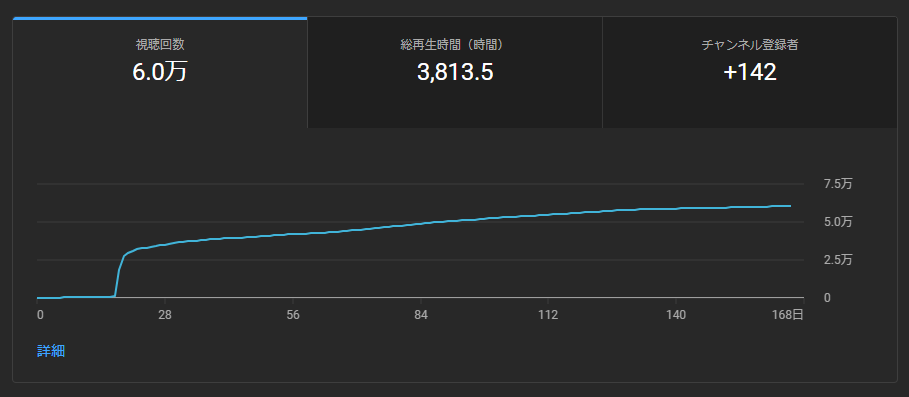

As a personal project, I created 16-minute explanatory videos for the game Genshin Impact, which I have been playing for over two years, and posted them on YouTube for Japanese users. For this project, I collected video materials, created AI-generated voice overs, and edited the videos by myself, and it took me approximately two weeks to complete everything. While the target audience was not very broad due to its focus on Japanese users, as of August 2023, the video on YouTube has accumulated over 60k views and had received about 2k likes.

This motivation behind starting this project was the desire to share the information I wished I had known when I was a beginner in this video game. I focused on conveying information in a clear and understandable manner, keeping the perspective of the listener in mind, and dedicated myself to creating the videos. I took extra care in adding detailed subtitles and implementing chapter divisions, thinking from the perspective of the listener to provide key points that would be advantageous to users. Since it was my first time creating AI-generated voice overs, I faced challenges in fine-tuning aspects like pronunciation and intonation. However, I was delighted to receive positive feedback from YouTube comments and see that it was warmly received.
