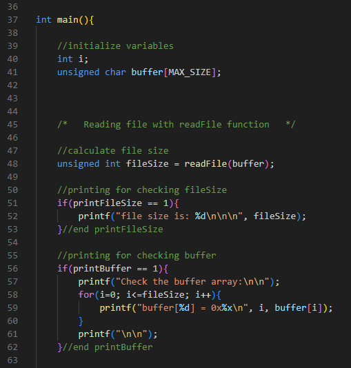

As my semester project for ICS 212, I recreated the SHA-1 Hash Algorithm code in C language which imports files from the command line and returns a specific hash value. Since I was learning C language for the first time in ICS 212, writing over 300 lines of code and implementing eight functions proved to be quite challenging for me. However, I believe that this project ultimately allowed me to gain a better understanding of C language and knowledge about Hash Algorithms.

Throughout this project, one particular challenge I faced was converting 'char' into binary character codes and transforming 8-bit strings into hexadecimal. This project involved performing various operations with long sections of code, and I had a particularly hard time identifying the specific areas where issues were arising during the bit string conversion. As a solution to this challenge, I created a boolean function for 'on' and 'off' in each function and verified their proper functioning in each function to identify and address issues. Furthermore, by printing out the calculation results in detail, I was able to identify which processes were producing incorrect results. By learning about the fundamentals of SHA-1, I gained some knowledge about encryption and improved my ability to work with complex code, which can have enhanced my skills in modifying code.

Source: <a href="https://github.com/jogarces/ics-313-text-game">
