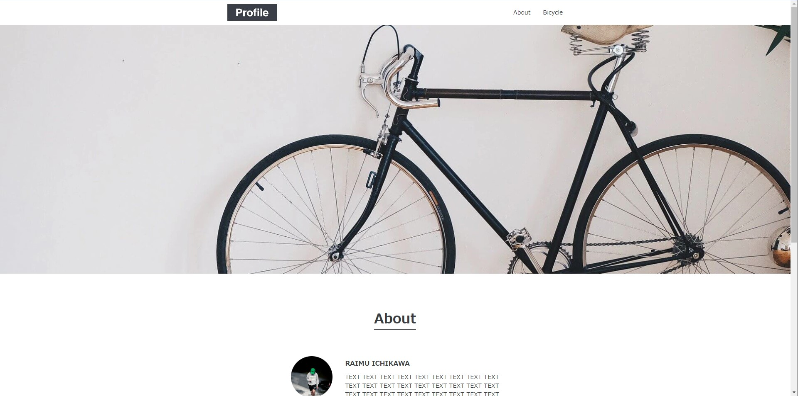
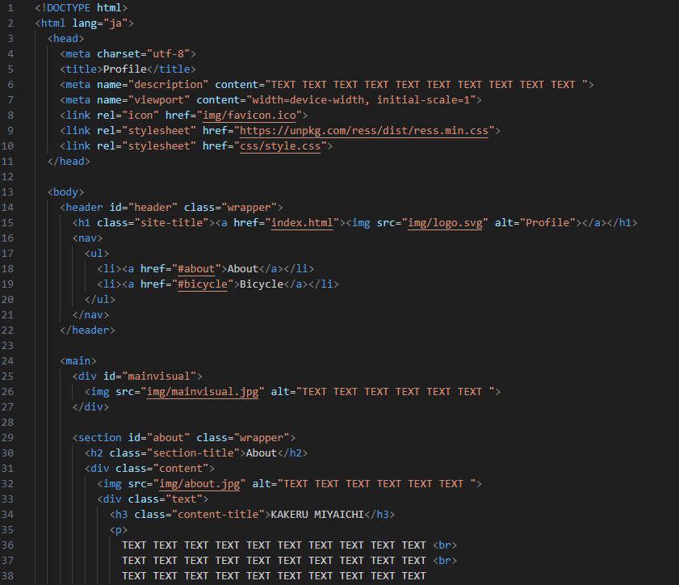

As a personal project to grasp the fundamentals of HTML and CSS, I engaged in reproducing code of an existing website. After initially learning the basics of HTML and CSS through online resources, I believed that reproducing existing websites would help me comprehend layout structures and the coding process. I saw it as a valuable opportunity for enhancing my own skills. I think that attempting to reproduce more complex websites through coding can lead to even greater skill improvement.

Through this project, I was able to grasp the fundamentals of HTML and CSS and gain an understanding of how to proceed with the coding process. Since this was a very basic coding practice, I intend to tackle the reproducing of more complex websites in the future. Furthermore, I believe that learning to utilize JavaScript for creating responsive design websites will contribute significantly to my skill development.
